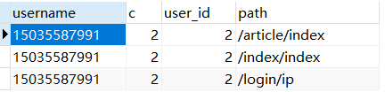
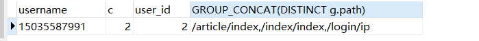

##  登录
- 当光标离开后，获取到文本框中的值
- 判断文本框中的值，是手机号还是邮箱
- 如果是邮箱，则验证码图片登录
- 如果是

##   日志系统
- 需求： 
    - 每次用户登录，需要记住用户登录的ip，登录的设备，浏览器
    - 用户在操作时，记录用户的行为
    - 统计当日的用户登录数，和当前的pageview
    - 分析出当天用户访问的一个排行榜  (top n)

- 所需要的表
~~~sql 
    --  用户登录记录表
    id
    记录ip
    登录设备
    使用的浏览器
    用户id
    登录的时间
    -- 日志表
    id 
    用户的访问路径
    访问的时间
    用户id
~~~
用户登录记录表
  每次用户登录成功，记录ip，设备，浏览器  到数据库
用户登录数    
​    where 时间
​    根据用户分组
​    计算出总记录数

~~~sql
    concat()   将多个字符串连接成一个字符串

    DISTINCT   
               用它来返回不重复记录的条数
               用于返回唯一不同的值

    GROUP_CONCAT
        语法:   group_concat([distinct] 要连接的字段 [order by 排序字段 asc/desc][separator '分隔符'])
        功能：  将 group by 产生的同一个分组中的值连接起来，返回一个字符串结果

            distinct 可以排除重复值，separator ，省略为一个逗号 

SELECT u.username,count(DISTINCT l.id) c,l.user_id,g.path
	FROM userlog l
	LEFT JOIN user u ON u.id = l.user_id
	LEFT JOIN log g ON u.id = g.user_id
	WHERE to_days(l.created_at) = to_days(now())
	GROUP BY l.user_id,g.path;

SELECT u.username,count(DISTINCT l.id) c,l.user_id,GROUP_CONCAT(DISTINCT g.path) path
	FROM userlog l
	LEFT JOIN user u ON u.id = l.user_id
	LEFT JOIN log g ON u.id = g.user_id
	WHERE to_days(l.created_at) = to_days(now())
	GROUP BY l.user_id;

  -- 访问今天内的所有数据
  select * from userlog where to_days(created_at) = to_days(now());

  --  今天用户访问的排行榜
  SELECT count(*) c,path
	FROM log
	WHERE to_days(created_at) = to_days(now())
	GROUP BY path
	ORDER BY c desc
~~~

日志表
​    保存：    访问路径，时间，用户id

    where  

##  图片的实时预览
